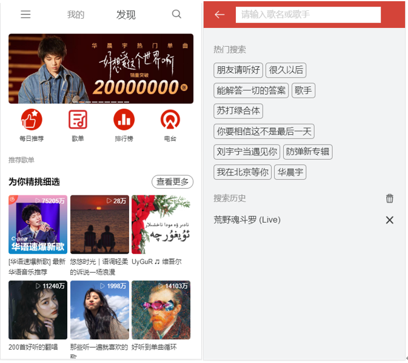
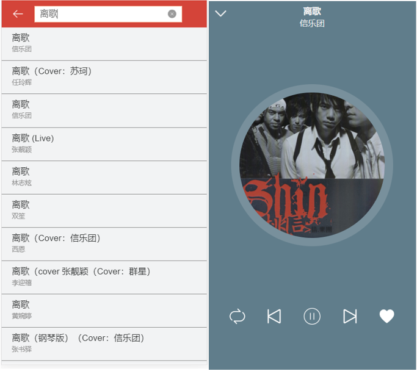
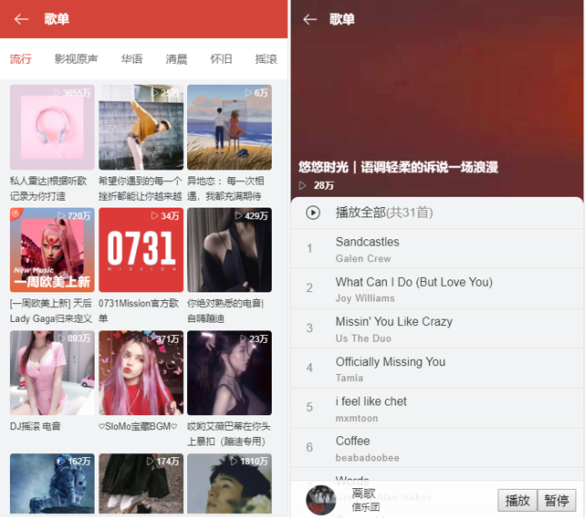
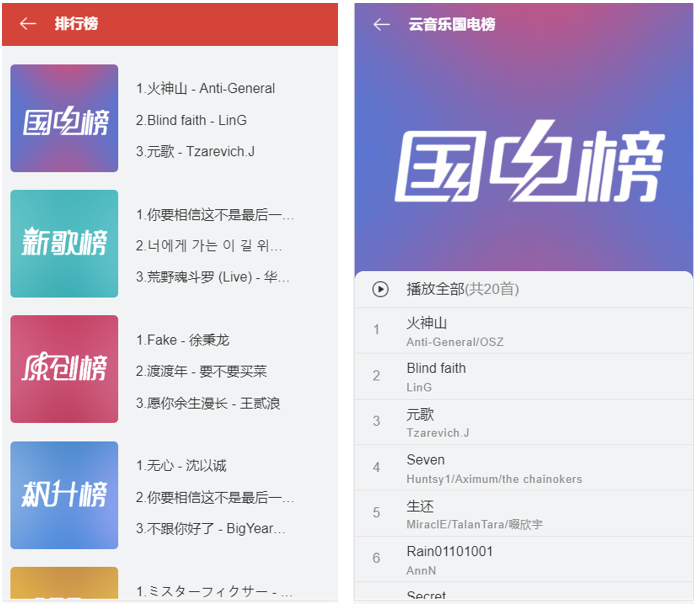
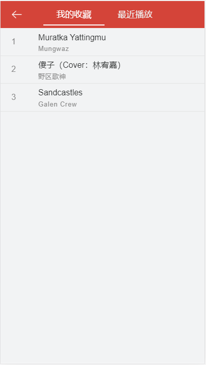

# 基于vue的仿网易云音乐WebApp

## 开发目的

通过仿写网易云音乐，使用Vue的全家桶，并使用了cubeui，让自己对vue全家桶的开发更加熟悉，对于组件化思想、代码的规范、ES6的使用上能有提升。

## 预览

### 首页、搜索页

### 搜索结果页、播放页面

### 歌单列表、歌单详情页

### 旁行榜列表、排行版页

### 搜藏、最近播放页

## 主要完成功能

1.点击播放，有两种播放形式：全屏和缩小化

2.查看推荐歌单，点击对应歌单进入详情

3.查看排行帮，点击进入对应排行榜详情

4.搜索页：显示热门搜索歌曲，显示搜索历史（存到localstorage中），搜索结果一次加载30条，可下拉加载，最多90条

5.歌曲操作：播放、暂停、继续、收藏、从头播放、播放上一首、播放下一首、一首完了后自动按最近播放顺序播放。

## 细节

### 关于收藏、历史记录、最近播放的存储

我使用了**good-storage**插件来把这些信息存到localstorage，以免关闭应用或应用刷新后丢失。

### 图片懒加载

使用**vue-lazyload**插件来实现对图片的懒加载，并给了一个默认的图片来进行占位，用户体验更好，后面可能会自己封装一个懒加载的插件。

### 下一步要完成的功能

1.添加今日推荐模块、歌手模块

2.加一个ActionSheet来展示当前播放列表

3.再添加播放条，进一步提高体验度

4.如果有缘还可以写登录与注册模块。。。

### 总结

#### 1.项目整体
这个项目作为练手的项目我觉得还是同不错的，基本涵盖了vue的全家桶，并且将state的设计与整体项目相配合完美也有点难度，也很考验前端对后台返回数据的处理。

### 2.项目缺陷
项目还有很多瑕疵，可能有些地方的bug我并没有测试到，毕竟也不是专业的测试😀。

### 3.性能优化

虽然使用到了懒加载，但是性能优化的点还不够多，能优化的空间还很大，后面学习性能优化再回头来改善。

### 4.代码质量

学习前端一年半以来，其实很早对代码质量、代码的复用性有了一些理解，但是一到写项目就记不起来，熟话说：能跑就行😄，后面还是需要参考优秀的源码来进一步提高代码质量。